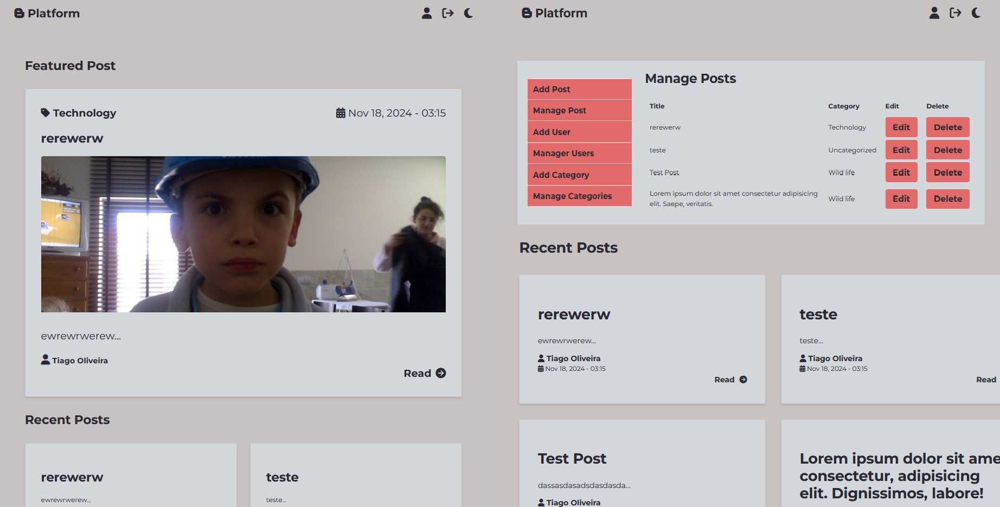

# BPlatform - Developer Setup

This project includes a local setup guide designed for XAMPP (Windows), LAMP (Linux/Mac), or Laragon. Follow these instructions to get the application running on your local machine.



## Prerequisites

- PHP and MySQL setup (via XAMPP, LAMP, or Laragon)
- Git

## Getting Started

### 1. Clone the Repository

Download the project files to your server by running:

```bash
git clone [repository-url]
cd project-folder
```
### 2. Create and Configure the Database

Open your PHPMyAdmin or database management tool.

Create a new database.

Open config.php in the project folder and update it with your credentials:

```bash

<?php
session_start();

define('WEBSITE_URL', '');
define('DB_HOST', ''); 
define('DB_NAME', ''); 
define('DB_USER', '');  
define('DB_PASSWORD', ''); 

```
### 3. Run SQL Scripts

Locate the provided SQL schema file (e.g., database_schema.sql).
Run this script in your database to initialize the required tables and structure.

### 4. Launch the Application

Start your web server (XAMPP, LAMP, or Laragon).
Open a web browser and go to http://localhost/project-folder to view the application locally.
